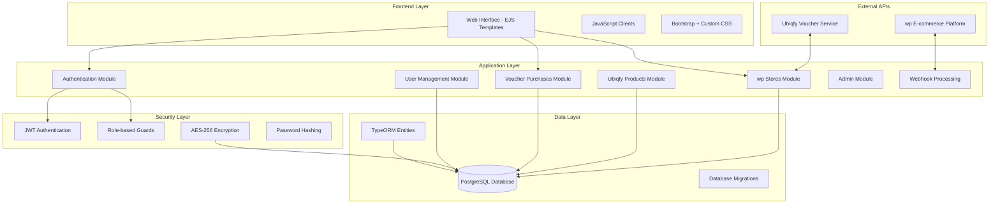
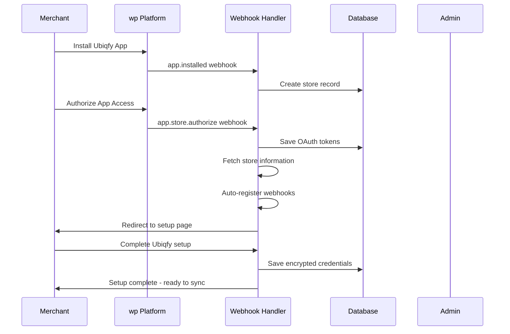
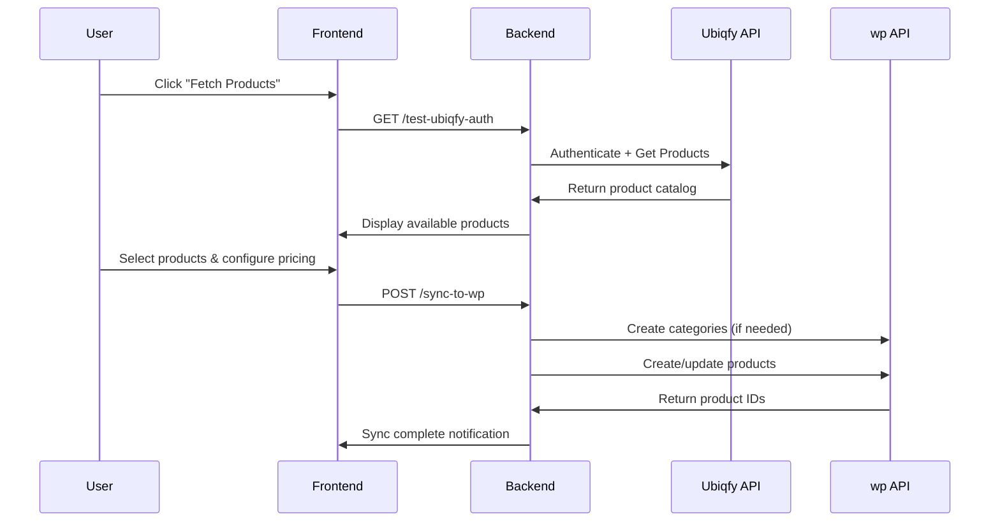
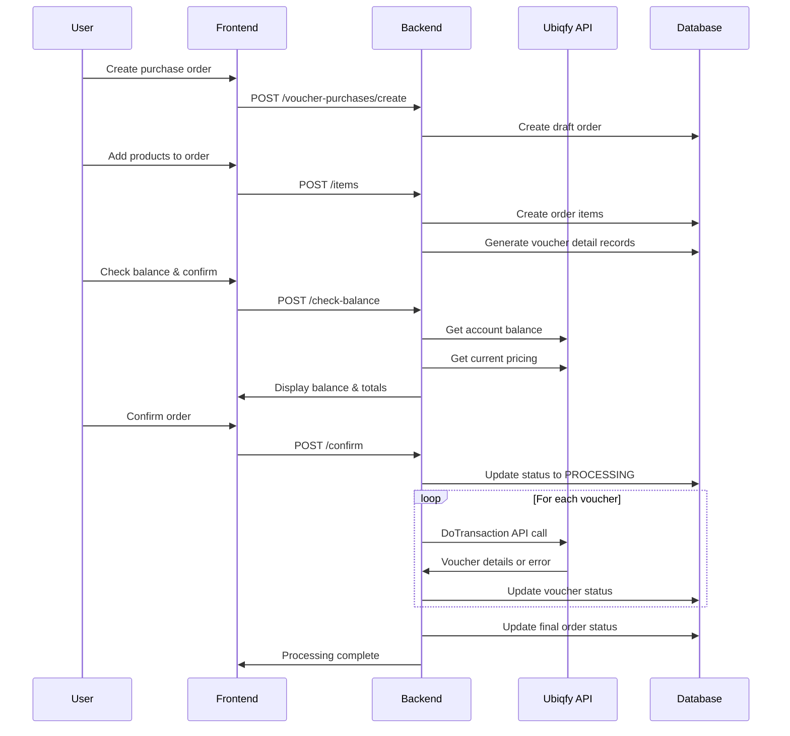

# wp-Ubiqfy Integration Platform - Technical Analysis

## Executive Summary

The wp-Ubiqfy Integration Platform is a comprehensive B2B e-commerce integration solution that bridges wp (Saudi Arabia's leading e-commerce platform) with Ubiqfy's digital voucher services. This platform enables seamless automated voucher sales, inventory management, and order processing through sophisticated API integrations and real-time webhook systems.

**Key Technologies**: NestJS, TypeScript, PostgreSQL, EJS Templates, Bootstrap, JWT Authentication

---

## 🏗️ Architecture Overview

### Technology Stack

#### Backend Framework
- **NestJS v11.x** - Progressive Node.js framework built on TypeScript
- **TypeScript** - Strongly typed JavaScript for enterprise-level development
- **Node.js v18+** - JavaScript runtime environment

#### Database & ORM
- **PostgreSQL v13+** - Production-ready relational database
- **TypeORM v0.3.x** - Feature-rich Object-Relational Mapping library
- **Database Migrations** - Version-controlled schema management

#### Frontend & UI
- **Server-Side Rendering** - EJS templates for dynamic content generation
- **Bootstrap v5.3** - Responsive CSS framework for modern UI
- **Font Awesome v6** - Comprehensive icon library
- **Vanilla JavaScript** - Client-side interactions without heavy frameworks

#### Authentication & Security
- **JWT (JSON Web Tokens)** - Stateless authentication mechanism
- **Passport.js** - Authentication middleware with multiple strategies
- **bcrypt** - Password hashing with salt rounds
- **AES-256-GCM encryption** - Advanced encryption for sensitive credentials

#### API Integration & Communication
- **REST APIs** - RESTful service architecture
- **Webhook Processing** - Real-time event-driven communication
- **Axios/Fetch API** - HTTP client for external API calls

### System Architecture Diagram



---

## 📊 Database Design & Schema

### Entity Relationship Model

The platform uses a normalized database design with the following key entities:

#### Core Entities

**1. Users Table (`users`)**
```sql
CREATE TABLE users (
    id UUID PRIMARY KEY,
    username VARCHAR UNIQUE NOT NULL,
    password VARCHAR NOT NULL,              -- bcrypt hashed
    isActive BOOLEAN DEFAULT TRUE,
    isSuperadmin BOOLEAN DEFAULT FALSE,
    assignedStoreId UUID REFERENCES wp_stores(id),
    created_at TIMESTAMP DEFAULT NOW(),
    updated_at TIMESTAMP DEFAULT NOW()
);
```

**2. wp Stores Table (`wp_stores`)**
```sql
CREATE TABLE wp_stores (
    id UUID PRIMARY KEY,
    wp_store_id VARCHAR UNIQUE NOT NULL,
    wp_store_name VARCHAR NOT NULL,
    wp_owner_name VARCHAR,
    wp_owner_email VARCHAR,
    wp_access_token VARCHAR,             -- OAuth token
    wp_refresh_token VARCHAR,
    wp_token_expiry TIMESTAMP,
    wp_webhook_key VARCHAR,
    wp_currency VARCHAR DEFAULT 'SAR',
    currency_conversion_rate DECIMAL(10,4) DEFAULT 3.75,
    
    -- Ubiqfy credentials (AES-256 encrypted)
    ubiqfy_username VARCHAR NOT NULL,
    ubiqfy_password VARCHAR NOT NULL,       -- AES-256-GCM encrypted
    ubiqfy_terminal_key VARCHAR NOT NULL,
    ubiqfy_sandbox BOOLEAN DEFAULT TRUE,
    ubiqfy_currency VARCHAR DEFAULT 'USD',
    ubiqfy_plafond DECIMAL(12,2),
    ubiqfy_producttypecode VARCHAR DEFAULT 'Voucher',
    
    -- Status tracking
    is_active BOOLEAN DEFAULT FALSE,
    last_sync_at TIMESTAMP,
    sync_status ENUM('pending','syncing','success','failed'),
    total_products_synced INTEGER DEFAULT 0,
    last_error_message TEXT,
    
    created_at TIMESTAMP DEFAULT NOW(),
    updated_at TIMESTAMP DEFAULT NOW()
);
```

**3. Product Relationships (`wp_store_products` & `wp_store_product_options`)**
```sql
CREATE TABLE wp_store_products (
    id UUID PRIMARY KEY,
    wp_store_id UUID REFERENCES wp_stores(id) ON DELETE CASCADE,
    ubiqfy_product_id UUID REFERENCES ubiqfy_products(id) ON DELETE CASCADE,
    is_active BOOLEAN DEFAULT TRUE,
    wp_category_id VARCHAR,
    wp_country_subcategory_id VARCHAR,
    sync_errors JSON,
    created_at TIMESTAMP DEFAULT NOW(),
    updated_at TIMESTAMP DEFAULT NOW(),
    UNIQUE(wp_store_id, ubiqfy_product_id)
);

CREATE TABLE wp_store_product_options (
    id UUID PRIMARY KEY,
    store_product_id UUID REFERENCES wp_store_products(id) ON DELETE CASCADE,
    ubiqfy_product_option_code VARCHAR NOT NULL,
    option_name VARCHAR NOT NULL,
    face_value DECIMAL(10,2) NOT NULL,
    wholesale_price DECIMAL(10,4),
    custom_price DECIMAL(10,2),
    markup_percentage DECIMAL(5,2),
    min_face_value DECIMAL(10,2),
    max_face_value DECIMAL(10,2),
    currency_code VARCHAR DEFAULT 'USD',
    wp_product_id VARCHAR,               -- Synced wp product ID
    current_stock INTEGER DEFAULT 0,
    minimum_stock_level INTEGER DEFAULT 0,
    created_at TIMESTAMP DEFAULT NOW(),
    updated_at TIMESTAMP DEFAULT NOW()
);
```

**4. Purchase Order System**
```sql
CREATE TABLE merchant_voucher_purchases (
    id UUID PRIMARY KEY,
    wp_store_id UUID REFERENCES wp_stores(id),
    created_by_user_id UUID REFERENCES users(id),
    purchase_order_number VARCHAR UNIQUE,   -- Generated: PO-2025-001
    status ENUM('draft','pending','processing','completed','failed','cancelled'),
    
    -- Financial tracking
    total_face_value DECIMAL(12,2) NOT NULL,
    total_wholesale_cost DECIMAL(12,4) NOT NULL,
    currency VARCHAR DEFAULT 'SAR',
    
    -- Processing metrics
    total_vouchers_ordered INTEGER DEFAULT 0,
    total_vouchers_generated INTEGER DEFAULT 0,
    total_vouchers_failed INTEGER DEFAULT 0,
    
    -- Balance validation
    ubiqfy_balance_before DECIMAL(12,4),
    ubiqfy_balance_after DECIMAL(12,4),
    
    -- Status tracking
    processing_started_at TIMESTAMP,
    processing_completed_at TIMESTAMP,
    error_message TEXT,
    success_message TEXT,
    navigation_url VARCHAR,
    
    created_at TIMESTAMP DEFAULT NOW(),
    updated_at TIMESTAMP DEFAULT NOW()
);
```

### Database Relationships & Constraints

1. **One-to-Many Relationships**:
   - Users ↔ wpStores (assigned store relationship)
   - wpStores ↔ StoreProducts ↔ ProductOptions
   - PurchaseOrders ↔ PurchaseItems ↔ VoucherDetails

2. **Referential Integrity**:
   - Cascading deletes for related records
   - Foreign key constraints enforced at database level
   - Unique constraints preventing duplicate relationships

3. **Data Validation**:
   - Enum constraints for status fields
   - Decimal precision for financial calculations
   - Timezone-aware timestamps (Asia/Riyadh)

---

## 🔐 Security Architecture

### Authentication & Authorization

#### Multi-Layer Security Model

**1. JWT-based Authentication**
```typescript
// JWT Strategy with multiple token sources
@Injectable()
export class JwtStrategy extends PassportStrategy(Strategy) {
  constructor(private usersService: UsersService) {
    super({
      jwtFromRequest: ExtractJwt.fromExtractors([
        ExtractJwt.fromAuthHeaderAsBearerToken(),    // Bearer token
        ExtractJwt.fromUrlQueryParameter('token'),   // Query parameter
        (request) => request?.cookies?.['access_token'] // HTTP-only cookie
      ]),
      secretOrKey: process.env.JWT_SECRET,
      ignoreExpiration: false,
    });
  }
}
```

**2. Role-Based Access Control (RBAC)**

- **SuperAdmin Guard**: Full system access
  ```typescript
  @Injectable()
  export class SuperAdminGuard implements CanActivate {
    canActivate(context: ExecutionContext): boolean {
      const user = context.switchToHttp().getRequest().user;
      return user?.isSuperadmin === true;
    }
  }
  ```

- **Store Access Guard**: Store-specific access control
  ```typescript
  @Injectable()
  export class StoreAccessGuard implements CanActivate {
    async canActivate(context: ExecutionContext): Promise<boolean> {
      const user = request.user;
      
      // Superadmins have access to all stores
      if (user.isSuperadmin) return true;
      
      // Regular users only access their assigned store
      if (!user.assignedStoreId) {
        throw new ForbiddenException('No store assigned');
      }
      
      // Validate store is active and matches request
      const store = await this.wpStoresService.findById(user.assignedStoreId);
      if (!store?.is_active) {
        throw new ForbiddenException('Store inactive');
      }
      
      return this.validateStoreAccess(user, request);
    }
  }
  ```

#### Data Encryption & Hashing

**1. AES-256-GCM Encryption for Sensitive Credentials**
```typescript
@Injectable()
export class PasswordService {
  private readonly algorithm = 'aes-256-gcm';
  private readonly keyLength = 32;  // 256 bits
  private readonly ivLength = 16;   // 128 bits

  encryptPassword(password: string): string {
    const key = this.getEncryptionKey();
    const iv = crypto.randomBytes(this.ivLength);
    const cipher = crypto.createCipheriv(this.algorithm, key, iv);
    
    cipher.setAAD(Buffer.from('ubiqfy-password', 'utf8'));
    
    let encrypted = cipher.update(password, 'utf8', 'base64');
    encrypted += cipher.final('base64');
    
    const authTag = cipher.getAuthTag();
    
    // Format: iv:encryptedData:authTag (all base64 encoded)
    return `${iv.toString('base64')}:${encrypted}:${authTag.toString('base64')}`;
  }
}
```

**2. bcrypt Password Hashing**
```typescript
@Entity('users')
export class User {
  @BeforeInsert()
  @BeforeUpdate()
  async hashPassword() {
    if (this.password) {
      const isBcryptHash = /^\$2[abyxy]?\$/.test(this.password);
      if (!isBcryptHash) {
        const saltRounds = 10;
        this.password = await bcrypt.hash(this.password, saltRounds);
      }
    }
  }
}
```

### API Security Measures

1. **HTTPS Enforcement**: All production traffic encrypted in transit
2. **Input Validation**: Comprehensive request validation using class-validator
3. **SQL Injection Prevention**: Parameterized queries through TypeORM
4. **Rate Limiting**: Configurable request throttling
5. **CORS Configuration**: Restricted cross-origin resource sharing
6. **Cookie Security**: HTTP-only, secure, SameSite cookies

---

## 🔗 API Integration Architecture

### wp Integration (OAuth 2.0 + Webhooks)

#### Webhook-Driven Installation Flow

```typescript
/**
 * Automatic store setup through wp webhooks
 * Zero-configuration OAuth flow
 */
@Post('handle')
async handleWebhook(@Body() payload: any, @Headers() headers: Record<string, string>) {
  const { event, merchant, data } = payload;
  
  switch (event) {
    case 'app.installed':
      // Create initial store record
      return this.handleAppInstalled(payload);
      
    case 'app.store.authorize':
      // Receive OAuth tokens and complete setup
      return this.handleStoreAuthorization(payload);
      
    case 'product.deleted':
      // Sync product deletions
      return this.handleProductDeleted(payload);
      
    case 'app.uninstalled':
      // Cleanup and deactivation
      return this.handleAppUninstalled(payload);
  }
}
```

#### OAuth Token Management
```typescript
async ensureValidwpToken(store: wpStore): Promise<void> {
  const now = new Date();
  const tokenExpiry = new Date(store.wp_token_expiry);
  
  if (tokenExpiry <= now) {
    // Automatic token refresh
    const refreshResult = await this.wpOAuthService.refreshToken(
      store.wp_refresh_token,
      this.getwpClientId(),
      this.getwpClientSecret()
    );
    
    // Update stored tokens
    store.wp_access_token = refreshResult.access_token;
    store.wp_token_expiry = new Date(Date.now() + refreshResult.expires_in * 1000);
    
    await this.wpStoreRepository.save(store);
  }
}
```

### Ubiqfy Integration (REST API)

#### Authentication & API Communication
```typescript
async authenticateWithUbiqfy(storeId: string): Promise<{
  success: boolean;
  token: string;
  plafond: number;
  baseUrl: string;
}> {
  const store = await this.findById(storeId);
  const baseUrl = store.ubiqfy_sandbox 
    ? process.env.SANDBOX_UBIQFY_URL 
    : process.env.PRODUCTION_UBIQFY_URL;

  const authPayload = {
    Username: store.ubiqfy_username,
    Password: store.getDecryptedPassword(),
    TerminalKey: store.ubiqfy_terminal_key,
  };

  const response = await fetch(`${baseUrl}/Authenticate`, {
    method: 'POST',
    headers: { 'Content-Type': 'application/json' },
    body: JSON.stringify(authPayload),
  });

  const result = await response.json();
  
  return {
    success: result.OperationSucceeded,
    token: result.Token,
    plafond: result.Plafond / 100, // Convert cents to currency units
    baseUrl
  };
}
```

#### Voucher Transaction Processing
```typescript
async processSingleVoucher(voucher: MerchantVoucherPurchaseDetail): Promise<void> {
  const { baseUrl, token } = await this.wpStoresService.authenticateWithUbiqfy(
    voucher.purchase.wpStore.id
  );

  const request: DoTransactionRequest = {
    Token: token,
    ProductCode: voucher.product_code,
    ProductOptionCode: voucher.product_option_code,
    Amount: voucher.face_value,
    ExternalId: voucher.external_id,
  };

  const response = await fetch(`${baseUrl}/dotransaction`, {
    method: 'POST',
    headers: {
      'Authorization': `Bearer ${token}`,
      'Content-Type': 'application/json'
    },
    body: JSON.stringify(request)
  });

  const responseData: DoTransactionResponse = await response.json();
  
  if (responseData.OperationSucceeded) {
    voucher.status = VoucherStatus.SUCCESS;
    voucher.serial_number = responseData.SerialNumber;
    voucher.transaction_id = responseData.TransactionId;
    voucher.reference = responseData.Reference;
  } else {
    voucher.status = VoucherStatus.FAILED;
    voucher.error_message = responseData.ErrorText;
  }
}
```

---

## 🎨 Frontend Architecture

### Server-Side Rendering (SSR) with EJS

The platform uses **server-side rendering** for optimal performance and SEO, combined with **progressive enhancement** through JavaScript.

#### Template Structure
```
views/
├── shared/
│   └── navbar.ejs              # Global navigation component
├── admin/
│   ├── dashboard.ejs           # Admin dashboard
│   ├── stores.ejs              # Store management
│   └── users.ejs               # User management
├── clients/
│   ├── index.ejs               # Store listing
│   ├── add.ejs                 # Add new store
│   ├── edit.ejs                # Edit store settings
│   ├── sync.ejs                # Product synchronization
│   └── stock.ejs               # Stock management
├── purchase/
│   ├── create.ejs              # Purchase order creation
│   ├── orders.ejs              # Order management
│   └── invoice.ejs             # Invoice generation
├── users/
│   └── change-password.ejs     # Password management
└── login.ejs                   # Authentication
```

#### CSS Architecture (Bootstrap + Custom)
```scss
// Organized CSS structure
public/css/
├── common.css                  # Global styles and variables
├── bootstrap-init.css          # Bootstrap customization
├── navbar.css                  # Navigation styling
├── login.css                   # Authentication pages
├── forms.css                   # Form components
├── clients.css                 # Store management
├── edit-page.css               # Product editing
├── purchases.css               # Order management
├── users.css                   # User management
└── error.css                   # Error pages
```

### JavaScript Architecture (Modular & Progressive)

#### Progressive Enhancement Pattern
```javascript
// Modular JavaScript architecture
public/js/
├── common.js                   # Shared utilities and helpers
├── bootstrap-init.js           # Bootstrap component initialization
├── toast-utils.js              # Notification system
├── store-data-init.js          # Data initialization
├── edit-page.js                # Product sync functionality
├── product-sync.js             # Sync operations
├── pricing-management.js       # Price calculations
├── stock-page.js               # Inventory management
├── purchase-order.js           # Order processing
├── purchase-create-utils.js    # Order creation helpers
└── user-management.js          # User operations
```

#### Example: Progressive Enhancement Pattern
```javascript
// edit-page.js - Product synchronization functionality
class ProductSyncManager {
  constructor() {
    this.storeData = null;
    this.selectedProducts = new Set();
    this.initialize();
  }

  initialize() {
    // Initialize only if required elements exist
    if (document.getElementById('productsContainer')) {
      this.initializeEventListeners();
      this.initializeStoreData();
    }
  }

  async syncProductsTowp() {
    if (this.selectedProducts.size === 0) {
      this.showAlert('Please select products to sync', 'warning');
      return;
    }

    try {
      this.showProgress('Preparing sync...', 10);
      
      const syncData = this.prepareSyncData();
      
      this.showProgress('Syncing to wp...', 50);
      
      const response = await fetch(`/wp-stores/${this.storeData.id}/sync-to-wp`, {
        method: 'POST',
        headers: { 'Content-Type': 'application/json' },
        body: JSON.stringify(syncData)
      });

      if (response.ok) {
        const result = await response.json();
        this.handleSyncSuccess(result);
      } else {
        throw new Error('Sync failed');
      }
    } catch (error) {
      this.handleSyncError(error);
    } finally {
      this.hideProgress();
    }
  }
}

// Auto-initialize when DOM is ready
document.addEventListener('DOMContentLoaded', () => {
  if (typeof window.productSyncManager === 'undefined') {
    window.productSyncManager = new ProductSyncManager();
  }
});
```

---

## 🔄 Business Process Flows

### 1. Store Onboarding Flow



### 2. Product Synchronization Flow



### 3. Purchase Order Processing Flow



---

## 📈 Performance & Scalability

### Database Optimization

#### Indexing Strategy
```sql
-- Performance-critical indexes
CREATE INDEX idx_wp_stores_active ON wp_stores(is_active);
CREATE INDEX idx_wp_stores_merchant ON wp_stores(wp_store_id);
CREATE INDEX idx_store_products_active ON wp_store_products(wp_store_id, is_active);
CREATE INDEX idx_product_options_store ON wp_store_product_options(store_product_id);
CREATE INDEX idx_purchases_status ON merchant_voucher_purchases(status, created_at);
CREATE INDEX idx_voucher_details_status ON merchant_voucher_purchase_details(status);
```

#### Connection Pooling & Configuration
```typescript
// Database module configuration
TypeOrmModule.forRootAsync({
  useFactory: (config: ConfigService) => ({
    type: 'postgres',
    // SSL for production databases
    ssl: config.get('DB_SSL_ENABLED') === 'true' ? {
      rejectUnauthorized: false
    } : false,
    
    // Connection pooling
    extra: {
      connectionTimeoutMillis: 10000,
      idleTimeoutMillis: 10000,
      max: 20, // Maximum connections
      min: 2,  // Minimum connections
    },
    
    // Timezone configuration
    timezone: 'Asia/Riyadh',
  })
})
```

### Caching Strategy

1. **Application-Level Caching**: Store frequently accessed configuration
2. **Database Query Caching**: Cache product catalogs and store information
3. **API Response Caching**: Cache Ubiqfy product data with TTL
4. **Static Asset Optimization**: CDN integration for CSS/JS files

### Asynchronous Processing

```typescript
// Voucher processing with rate limiting
async processPurchaseOrder(purchaseId: string): Promise<void> {
  const pendingVouchers = await this.getPendingVouchers(purchaseId);
  
  let processedCount = 0;
  
  for (const voucher of pendingVouchers) {
    try {
      await this.processSingleVoucher(voucher);
      processedCount++;
      
      // Rate limiting: 1 second delay every 10 vouchers
      if (processedCount % 10 === 0) {
        await new Promise(resolve => setTimeout(resolve, 1000));
      }
    } catch (error) {
      this.logger.error(`Voucher processing failed: ${error.message}`);
    }
  }
}
```

---

## 🔧 DevOps & Deployment

### Environment Configuration

#### Production Environment Variables
```bash
# Application Settings
NODE_ENV=production
PORT=3000
APP_BASE_URL=https://yourdomain.com
WEBHOOK_BASE_URL=https://yourdomain.com

# Database Configuration
DB_HOST=your-postgres-host
DB_PORT=5432
DB_USERNAME=your-db-user
DB_PASSWORD=your-secure-password
DB_DATABASE=wp_ubiqfy_integration
DB_SSL_ENABLED=true

# Security Configuration
JWT_SECRET=your-256-bit-jwt-secret
ENCRYPTION_KEY=your-256-bit-encryption-key

# wp API (Auto-configured via webhooks)
wp_BASE_URL=https://api.wp.dev/admin/v2
wp_AUTH_BASE=https://accounts.wp.sa/oauth2
wp_WEBHOOK_SECRET_KEY=your-webhook-secret

# Ubiqfy API Configuration
PRODUCTION_UBIQFY_URL=https://api.ubiqfy.com:5276
SANDBOX_UBIQFY_URL=https://api-sandbox.ubiqfy.com

# Admin Configuration
SAP=Admin@123  # Superadmin password
```

### Docker Deployment

```dockerfile
# Multi-stage Dockerfile for optimized production builds
FROM node:18-alpine AS builder

WORKDIR /app
COPY package*.json ./
RUN npm ci --only=production && npm cache clean --force

COPY . .
RUN npm run build

# Production image
FROM node:18-alpine AS production

RUN addgroup -g 1001 -S nodejs
RUN adduser -S nestjs -u 1001

WORKDIR /app

COPY --from=builder --chown=nestjs:nodejs /app/node_modules ./node_modules
COPY --from=builder --chown=nestjs:nodejs /app/dist ./dist
COPY --from=builder --chown=nestjs:nodejs /app/views ./views
COPY --from=builder --chown=nestjs:nodejs /app/public ./public

USER nestjs

EXPOSE 3000

CMD ["node", "dist/main.js"]
```

### CI/CD Pipeline

```yaml
# GitHub Actions workflow
name: Deploy to Production

on:
  push:
    branches: [main]

jobs:
  deploy:
    runs-on: ubuntu-latest
    
    steps:
      - uses: actions/checkout@v3
      
      - name: Setup Node.js
        uses: actions/setup-node@v3
        with:
          node-version: 18
          
      - name: Install dependencies
        run: npm ci
        
      - name: Run tests
        run: npm test
        
      - name: Build application
        run: npm run build
        
      - name: Run database migrations
        run: npm run migration:run
        env:
          NODE_ENV: production
          
      - name: Deploy to production
        run: |
          pm2 restart ecosystem.config.js --env production
```

---

## 🔍 Monitoring & Observability

### Error Handling & Logging

```typescript
// Global exception filter
@Catch()
export class GlobalExceptionFilter implements ExceptionFilter {
  catch(exception: any, host: ArgumentsHost) {
    const ctx = host.switchToHttp();
    const response = ctx.getResponse();
    const request = ctx.getRequest();
    
    const status = exception instanceof HttpException 
      ? exception.getStatus() 
      : HttpStatus.INTERNAL_SERVER_ERROR;

    // Log error with context
    this.logger.error('Request failed', {
      url: request.url,
      method: request.method,
      status,
      error: exception.message,
      stack: exception.stack,
      userId: request.user?.userId,
      storeId: request.params?.storeId,
    });

    // Return structured error response
    response.status(status).json({
      success: false,
      message: this.getErrorMessage(exception),
      timestamp: new Date().toISOString(),
      path: request.url,
    });
  }
}
```

### Health Checks & Metrics

```typescript
// Health check endpoint
@Get('health')
async healthCheck() {
  const checks = await Promise.allSettled([
    this.checkDatabase(),
    this.checkwpAPI(),
    this.checkUbiqfyAPI(),
  ]);
  
  const isHealthy = checks.every(check => check.status === 'fulfilled');
  
  return {
    status: isHealthy ? 'healthy' : 'degraded',
    timestamp: new Date().toISOString(),
    checks: {
      database: checks[0].status,
      wp: checks[1].status,
      ubiqfy: checks[2].status,
    },
  };
}
```

---

## 🚀 Future Enhancements & Roadmap

### Technical Improvements

1. **Microservices Architecture**
   - Split into domain-specific services (Auth, Store, Voucher)
   - Message queue integration (Redis/RabbitMQ)
   - API Gateway for service orchestration

2. **Real-time Features**
   - WebSocket integration for live updates
   - Server-sent events for order processing status
   - Real-time inventory synchronization

3. **Advanced Analytics**
   - Business intelligence dashboard
   - Sales performance metrics
   - Predictive inventory management

4. **API Expansion**
   - GraphQL API for complex queries
   - REST API versioning strategy
   - Third-party integration marketplace

### Security Enhancements

1. **Advanced Authentication**
   - Multi-factor authentication (MFA)
   - OAuth 2.0 with PKCE
   - Social login integration

2. **Compliance & Auditing**
   - GDPR compliance features
   - Audit log system
   - Data retention policies

---

## 📚 Technical Documentation

### Code Quality & Standards

- **TypeScript Strict Mode**: Enabled for type safety
- **ESLint + Prettier**: Code formatting and linting
- **Jest Testing**: Unit and integration tests
- **Husky Git Hooks**: Pre-commit quality checks

### Development Workflow

```bash
# Development setup
npm install                    # Install dependencies
cp .env.example .env          # Configure environment
npm run migration:run         # Setup database
npm run start:dev            # Start development server

# Quality checks
npm run lint                  # ESLint checks
npm run format               # Prettier formatting
npm test                     # Run test suite
npm run test:e2e            # End-to-end tests
```

### API Documentation

The platform provides comprehensive API documentation with:

- **OpenAPI/Swagger**: Interactive API documentation
- **Postman Collections**: Ready-to-use API testing
- **Code Examples**: Implementation guides for common operations
- **Error Codes**: Detailed error handling documentation

---

This technical analysis provides a comprehensive overview of the wp-Ubiqfy Integration Platform's architecture, implementation details, and operational characteristics. The platform demonstrates enterprise-grade development practices with robust security, scalable architecture, and maintainable code structure suitable for production e-commerce environments.